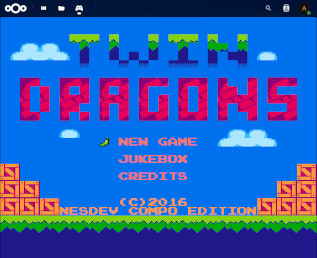

# NextCloud Nostalgist

Run emulators of retro consoles directly in NextCloud via [Nostalgist.js](https://nostalgist.js.org/).

[](img/screenshot.png)

## Usage

1. Download the app
	```sh
	cd /path/to/nextcloud/apps
	git clone https://github.com/robloach/nextcloud-nostalgist.git nostalgist
	```

2. Enable the Nostalgist app

## Known Issues

### Content Security Policy

Need to allow WASM execution, and loading external content...

```diff
diff --git a/lib/public/AppFramework/Http/ContentSecurityPolicy.php b/lib/public/AppFramework/Http/ContentSecurityPolicy.php
index 281aaa06eb8..c45b2da1acd 100644
--- a/lib/public/AppFramework/Http/ContentSecurityPolicy.php
+++ b/lib/public/AppFramework/Http/ContentSecurityPolicy.php
@@ -27,7 +27,7 @@ class ContentSecurityPolicy extends EmptyContentSecurityPolicy {
 	/** @var bool Whether eval in JS scripts is allowed */
 	protected $evalScriptAllowed = false;
 	/** @var bool Whether WebAssembly compilation is allowed */
-	protected ?bool $evalWasmAllowed = false;
+	protected ?bool $evalWasmAllowed = true;
 	/** @var bool Whether strict-dynamic should be set */
 	protected $strictDynamicAllowed = false;
 	/** @var bool Whether strict-dynamic should be set for 'script-src-elem' */
@@ -55,6 +55,7 @@ class ContentSecurityPolicy extends EmptyContentSecurityPolicy {
 	/** @var array Domains to which connections can be done */
 	protected $allowedConnectDomains = [
 		'\'self\'',
+		'cdn.jsdelivr.net'
 	];
 	/** @var array Domains from which media elements can be loaded */
 	protected $allowedMediaDomains = [

```

## TODO

- [ ] Make it work

## Credits

- https://www.svgrepo.com/svg/255536/game-controller-gamepad
- https://github.com/arianrhodsandlot/nostalgist
- https://github.com/arianrhodsandlot/retroarch-emscripten-build
