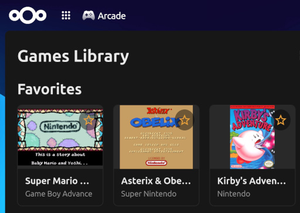

# NextCloud Nostalgist

Play retro console games directly in NextCloud, through
[Nostalgist.js](https://nostalgist.js.org/) and the RetroArch libretro cores
compiled to WebAssembly. Nothing is emulated on the server: ROMs are streamed
from your files and run in the browser.

[](img/screenshot.png)

## Features

- Plays ROMs straight from the Files app, in the file viewer.
- A games library page with grid, list and table views.
- Six save state slots per game, each with a screenshot, unique per user.
- In-game battery saves (SRAM) synchronized automatically.
- Player controls: pause, restart, mute, fast-forward, the RetroArch menu,
  screenshots, fullscreen, and a virtual gamepad on touch devices.
- Zipped ROMs, extracted in the browser.
- Thumbnails for your games, matched from a folder of images.
- Works on publicly shared files and folders.

## Installation

1. Download the app

	```sh
	cd /path/to/nextcloud/apps
	git clone https://github.com/robloach/nextcloud-nostalgist.git nostalgist
	```

2. Enable the Nostalgist app

Updating is `git pull` in that folder: the built JavaScript and the emulator
cores are committed, so nothing needs to be built on the server.

## Usage

### From the Files app

Open a ROM (for example a `.nes` file) and it starts playing in the file
viewer. Files are recognized both by mimetype and by file extension, and a
"Play with Nostalgist" action is available in the file's menu.

Zipped ROMs work through the same menu action on `.zip` files. The system is
detected from the file inside the archive, or from the folder the game is
stored in — short names and No-Intro platform names both work, so
`Games/SNES/NHL 96.zip` and
`Games/Nintendo - Super Nintendo Entertainment System/NHL 96.zip` are both
recognized as Super Nintendo.

ROMs uploaded before the app was enabled keep their generic mimetype until
the mimetype repair step runs, which happens on install and on upgrades. It
can also be run manually:

```sh
occ maintenance:repair
occ maintenance:mimetype:update-db
```

They still open through the file action either way, matched by extension.

### From the Nostalgist page

The app's own page lists the games in your library folder (`/Games` by
default). Three views are available and the choice is remembered:

| View | Shows |
| --- | --- |
| Grid | Large thumbnails, the default |
| List | Compact rows with small thumbnails |
| Table | Sortable columns: name, system, size, modified |

Large libraries are paged (24 to 240 games per page). The scan of the library
folder is cached and keyed on the folder's ETag, so it is only walked again
when something in it changes; the refresh button in the header forces a
rescan. Up to 5000 games and six folder levels deep are listed.

### Player controls

A control bar overlays the bottom of the player with pause/resume, restart,
a save state menu, mute, fast-forward, the RetroArch menu (core options,
control remapping and more), screenshot, and fullscreen. On touch devices a
virtual gamepad is overlaid too — a D-pad with diagonals, A/B/X/Y, L/R,
Start and Select — toggleable from the control bar.

The save state menu has six slots per game, each with a screenshot thumbnail
and a timestamp; saving or loading a slot closes the menu and returns to the
game. States are stored per user and per game on the server, so every
NextCloud user has their own saves, even for a shared ROM.

In-game battery saves (SRAM) are restored when a game starts, and uploaded
every minute and when the page closes, so progress saved through a game's own
save system survives. When a game has save states, the player offers to
continue from the most recent one at launch.

Save states and SRAM are not available on public share links, since there is
no user to store them for.

### Settings

Personal settings → Nostalgist:

| Setting | Default | Description |
| --- | --- | --- |
| Smooth video filtering | Off | Bilinear filtering instead of sharp pixels |
| Capture input globally | On | Send gamepad and keyboard input to the game while playing |
| Fast-forward ratio | 2 | Speed multiplier of the fast-forward button, 0 for unlimited |
| Games library folder | `/Games` | Scanned for the games library page |
| Saves folder | empty | Save states and their screenshots, in your own files |
| Screenshots folder | empty | Where the screenshot button saves images |
| Thumbnails folder | empty | Images used as game thumbnails |
| Emulator cores | see below | The libretro core used for each system |

Folder settings have a browse button that opens the NextCloud file picker.

Thumbnails are matched by file name and subfolder, so with a thumbnails
folder of `Thumbs`, `Games/NES/Mario.nes` uses `Thumbs/NES/Mario.png`, and
falls back to `Thumbs/Mario.png`. PNG, JPEG, WebP and GIF are supported.

With a saves folder set, save states are written to your own files as
`Saves/Mario/Slot 1.state` with `Slot 1.png` next to it, and the battery save
as `Saves/Mario/Mario.srm`, so they sync to your devices. Left empty, they
are kept in the app's internal storage instead. Switching the setting does
not move existing saves.

### Cores

The default libretro core for each supported system ships with the app:

| System | Core |
| --- | --- |
| NES | fceumm |
| SNES | snes9x |
| Game Boy / Game Boy Color | gambatte |
| Game Boy Advance | mgba |
| Genesis / Mega Drive, Master System, Game Gear | genesis_plus_gx |
| Sega 32X | picodrive |
| PC Engine / TurboGrafx-16 | mednafen_pce_fast |
| Atari Lynx | handy |
| Neo Geo Pocket | mednafen_ngp |
| WonderSwan | mednafen_wswan |
| Virtual Boy | mednafen_vb |
| Vectrex | vecx |
| ColecoVision | gearcoleco |

To also extract the alternative cores (`nestopia`, `quicknes`, `snes9x2010`,
`gearboy`, `picodrive`, …) that can then be selected per system in the
settings, run:

```sh
npm run cores
```

They come from
[retroarch-emscripten-build](https://github.com/arianrhodsandlot/retroarch-emscripten-build),
which is a git submodule of this repository.

## Performance

The emulator cores are WebAssembly files of a few megabytes that the browser
downloads and compiles on every launch. On Apache, the app ships an
`.htaccess` in `img/cores/` that sets the `application/wasm` mimetype
(streaming compilation), a week-long `Cache-Control`, and gzip compression —
no configuration needed.

On nginx, add the equivalent to the NextCloud server block:

```nginx
location ~ ^/apps/nostalgist/img/cores/ {
    types { application/wasm wasm; }
    add_header Cache-Control "public, max-age=604800";
    gzip on;
    gzip_types application/wasm application/javascript;
}
```

A memory cache (Redis or APCu) makes the games library page faster, since
that is where the scanned library is cached.

## Content Security Policy

The app adds the allowances Nostalgist.js needs — WebAssembly compilation
(`wasm-unsafe-eval`) and `blob:` sources for scripts, workers, frames,
connections, images and media — to the policy of every page, since the player
also runs inside the Files app. No changes to the NextCloud server are
required.

## Development

```sh
npm install
npm run build     # production bundles into js/
npm run watch     # rebuild on change
npm run cores     # extract every core from the submodule
```

The built bundles in `js/` are committed, so rebuild and commit them along
with any change to `src/`.

### Project structure

```
appinfo/info.xml            App metadata, repair steps, settings registration
lib/CoreMap.php             Systems: extensions, mimetypes, cores, folder aliases
lib/AppInfo/Application.php Mimetype registration and event listeners
lib/Controller/             Page, library, settings and save state endpoints
lib/Listener/               Files and Viewer script loading, Content Security Policy
lib/Migration/              Mimetype repair step
lib/Service/                Settings and save state storage
lib/Settings/               Personal settings section
src/main.js                 The app page: player or games library
src/library.js              Games library views and pagination
src/player.js               Shared launcher, ROM fetching, zip extraction, SRAM
src/toolbar.js              Player control bar and save state menu
src/touch.js                Virtual gamepad
src/files.js                Files app actions
src/viewer.js               Viewer handler
src/settings.js             Personal settings page
src/systems.js              System lookup shared by the frontend
templates/                  App page and settings markup
img/cores/                  Emulator cores
```

### HTTP endpoints

All of them are user-scoped and require a session.

| Method | Route | Purpose |
| --- | --- | --- |
| GET | `/apps/nostalgist/` | The app page, `?file=` plays a game |
| GET | `/apps/nostalgist/library` | Games, paged: `offset`, `limit`, `sort`, `order`, `refresh` |
| GET/POST | `/apps/nostalgist/settings` | Personal settings |
| GET | `/apps/nostalgist/states` | Save state slots of a game |
| GET/POST/DELETE | `/apps/nostalgist/state` | A save state slot |
| GET/POST | `/apps/nostalgist/state/thumbnail` | The screenshot of a slot |
| GET/POST | `/apps/nostalgist/sram` | The in-game battery save |

## Credits

- https://www.svgrepo.com/svg/255536/game-controller-gamepad
- https://github.com/arianrhodsandlot/nostalgist
- https://github.com/arianrhodsandlot/retroarch-emscripten-build
