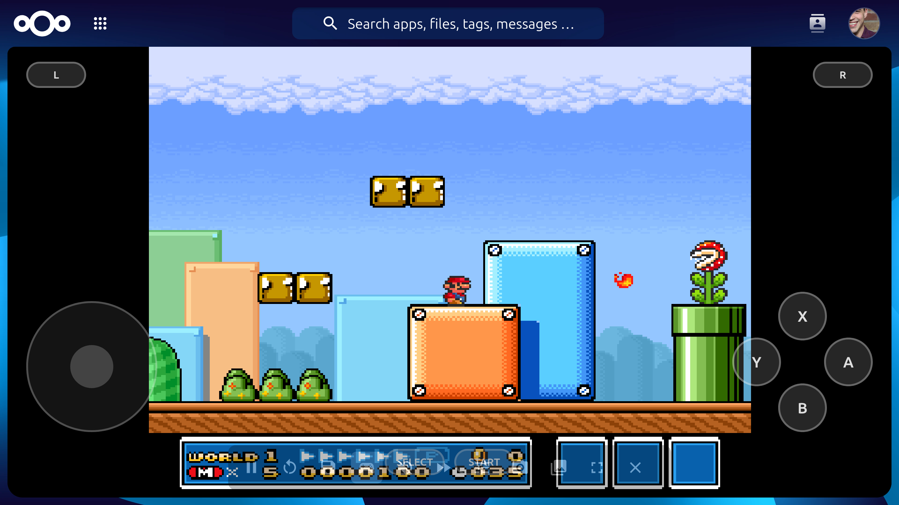
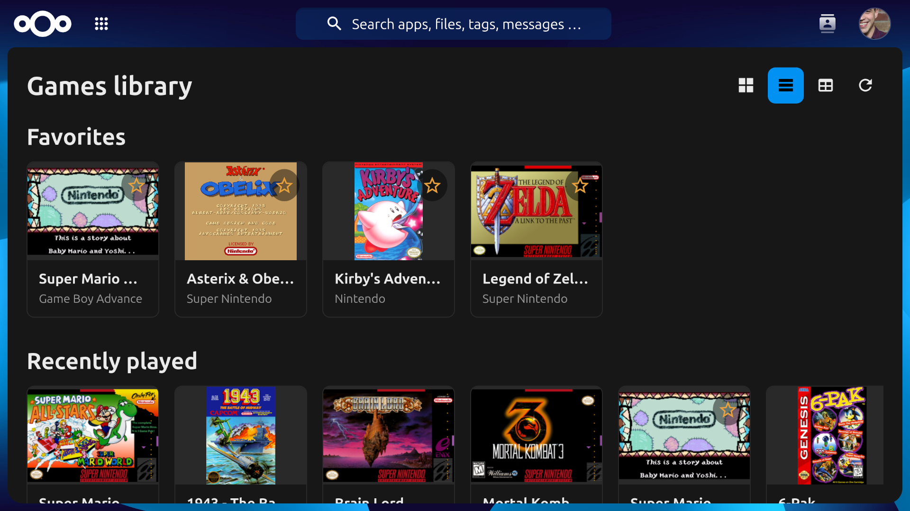
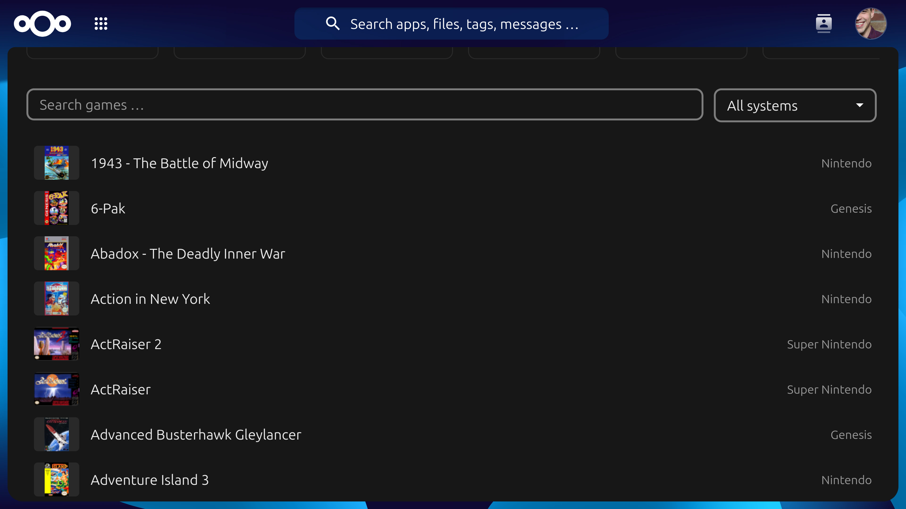
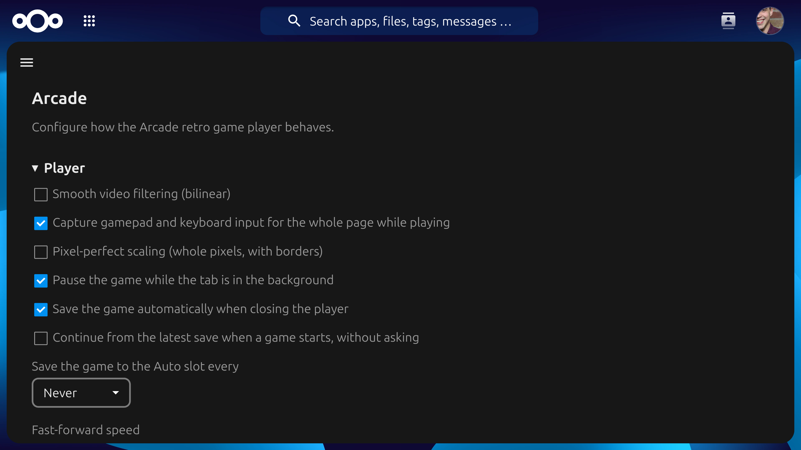

# NextCloud Arcade

Play retro console games directly in NextCloud, through
[Nostalgist.js](https://nostalgist.js.org/) and the RetroArch libretro cores
compiled to WebAssembly. Nothing is emulated on the server: ROMs are streamed
from your files and run in the browser.

[](img/screenshot.png)

| | |
| --- | --- |
| [](screenshots/game.png) | [](screenshots/games-library.png) |
| A game running, with the touch controls and the player bar | The games library, with favorites and recently played |
| [](screenshots/games-list.png) | [](screenshots/configuration.png) |
| The same library as a list | The personal settings |

## Features

- Plays ROMs straight from the Files app, in the file viewer, with box art
  as their preview.
- A games library page with grid, list and table views.
- Three save state slots per game plus an automatic one, each with a
  screenshot, unique per user.
- In-game battery saves (SRAM) synchronized automatically.
- Player controls: pause, restart, mute, fast-forward, the RetroArch menu,
  screenshots, fullscreen, and a virtual gamepad on touch devices.
- Zipped ROMs, extracted in the browser.
- Thumbnails for your games, matched from a folder of images, downloaded
  from the libretro thumbnail server, or taken from their own screenshots
  and save states — and matched on the name the cartridge gives itself when
  the file name says nothing.
- Favorites shared with the Files app -- the same star -- and how long
  each game was played.
- Works on publicly shared files and folders.

## Installation

Nextcloud 34 or 35, on PHP 8.3 or newer. A browser with WebAssembly, which
is every current one.

It needs the **Files** app, for the games themselves, the favorites and the
mimetypes, and the **Viewer** app, to play a ROM from the Files app. Both are
always-enabled apps of Nextcloud, so there is nothing to install and no way
to turn them off. That is stated here rather than declared in
`appinfo/info.xml`: the app store schema has elements for PHP, databases,
libraries, commands, architectures and the Nextcloud version, and none for
depending on another app.

1. Download the app

	```sh
	cd /path/to/nextcloud/apps
	git clone https://github.com/robloach/nextcloud-arcade.git arcade
	```

2. Enable the Arcade app

Updating is `git pull` in that folder: the built JavaScript and the emulator
cores are committed, so nothing needs to be built on the server.

## Usage

Open a ROM in the Files app — a `.nes`, `.sfc`, `.gb` or any of the
[other systems](docs/cores.md) — and it plays in the file viewer. Zipped
ROMs, and ROMs Nextcloud has not learned the mimetype of yet, open from the
**Play with Arcade** entry in the file menu.

The app's own page lists everything in your games library folder (`/Games`
by default) as a grid, a list or a sortable table, with box art, favorites
and the games you played last. Pick one and it starts.

A game is played in the browser, so nothing is emulated on the server and
nothing is uploaded anywhere. Save states, battery saves and screenshots go
back into your own files, where they sync to your devices like anything
else.

## Documentation

| Page | What is in it |
| --- | --- |
| [Using Arcade](docs/usage.md) | Playing from Files and from the Arcade page, and every player control |
| [Settings](docs/settings.md) | Every personal and administration setting, and where saves are kept |
| [Thumbnails](docs/thumbnails.md) | Where the pictures of your games come from, and how they are matched |
| [BIOS files](docs/bios.md) | The systems that ask for one, and how to give it to them |
| [Emulator cores](docs/cores.md) | One core per system, and the systems they run |
| [Performance and security](docs/performance.md) | Caching, cores, and the Content Security Policy |
| [Development](docs/development.md) | Building it, what lives where, the endpoints, and what it stores |

## Credits

Everything the app is built on, and what each part is for, is in
[AUTHORS.md](AUTHORS.md). What changed in each version is in
[CHANGELOG.md](CHANGELOG.md).

- https://www.svgrepo.com/svg/255536/game-controller-gamepad
- https://github.com/arianrhodsandlot/nostalgist
- https://github.com/arianrhodsandlot/retroarch-emscripten-build
